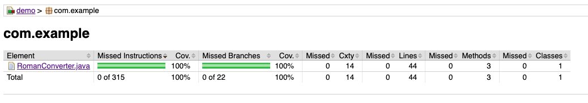

# Roman Numeral Converter

A simple Java 17 library built with TDD to convert Roman numerals to integers and integers to Roman numerals.

## Prerequisites

- Java 17
- Maven 3.8+

## Domain Rules

This project follows the standard Roman numeral rules and enforces a strict maximum value of `3999` (`MMMCMXCIX`).

- Supported symbols: `I`, `V`, `X`, `L`, `C`, `D`, `M`
- Basic values:
  - `I = 1`
  - `V = 5`
  - `X = 10`
  - `L = 50`
  - `C = 100`
  - `D = 500`
  - `M = 1000`
- Subtractive notation is allowed only for valid pairs:
  - `I` before `V` or `X`
  - `X` before `L` or `C`
  - `C` before `D` or `M`
- The maximum representable value is `3999`
- Inputs outside the supported range or malformed Roman numerals should be treated as invalid
- Examples of invalid forms include empty strings, lowercase symbols, illegal repetitions such as `IIII`, and values above `3999`

## Project Structure

```text
demo/
├── pom.xml
└── src
    ├── main
    │   └── java
    │       └── com
    │           └── example
    │               └── RomanConverter.java
    └── test
        └── java
            └── com
                └── example
                    └── RomanConverterTest.java
```

## How to Run the Tests and View the JaCoCo Report

From the `demo` directory, run the test suite with:

```bash
mvn test
```

This command executes the JUnit Jupiter tests and generates the JaCoCo coverage report during the test phase.

After the build completes, open the report at:

```text
demo/target/site/jacoco/index.html
```

If you are starting from the repository root, move into the Maven module first:

```bash
cd demo
mvn test
```
## Coverage Report

The final test coverage is **100%**.

To generate this report locally:
```bash
mvn clean test
# Then
open target/site/jacoco/index.html
